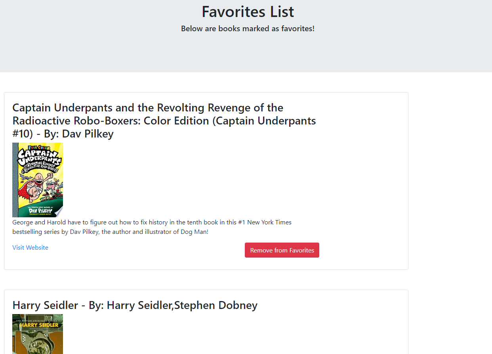

# 📖 [Google-Books](https://aqueous-dawn-11366.herokuapp.com/) 📖

 

This is a full stack React application that allows the user to search for any book by title.  After the search is entered, it submits the title through google's API and returns the first 10 matches.  When the books are displayed, if the user sees a book he/she likes, they can add it to their favorites list which store the book and its information into Mongo Atlas DB.  When the add to favorites is clicked, the button gets disabled so the user will not be able to add the book multiple times into the database. 
 
On the Navbar on the top, there is a link to access the favorites page.  When this is clicked, it will automatically pull all the books from the database and display them on the screen.  After the user reads or wants to remove the book, there is a red delete button.  This will not only remove the book from the screen but will delete it from the database as well.   
 

Techhnologies used: HTML, CSS, React, Javascript, Node.js, Mongo Database, Express, Bootstrap

Created by: Vincent Doria Jr.
